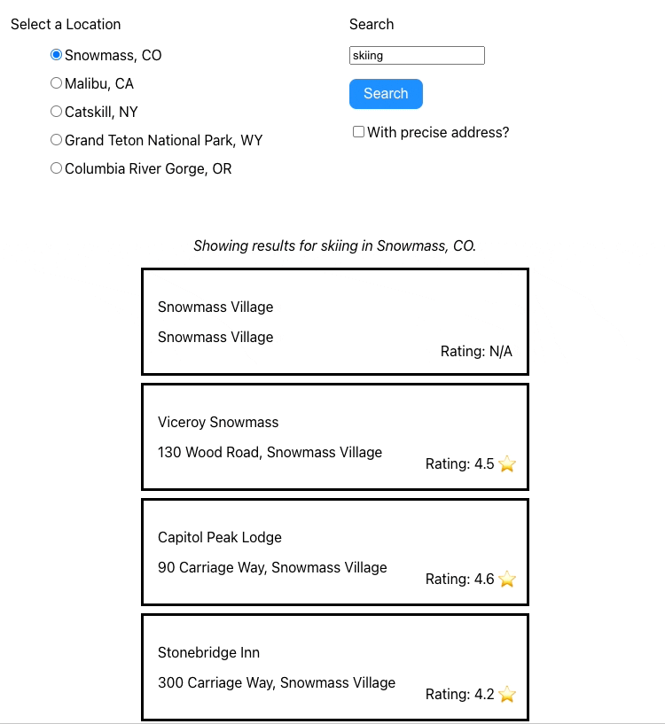

# Sensible Weather

## Full Stack Web Engineering take home exercise

## About

Uses [Google’s “Nearby Search” API](https://developers.google.com/maps/documentation/places/web-service/search-nearby)
to allow a user to select from a list of locations and enter any keyword.

## Setup

* Create `.env` file at the root of the project, and add your Google Places Auth Token with the key `REACT_APP_PLACES_API_KEY`.
 
i.e. `REACT_APP_PLACES_API_KEY=<YOUR API KEY>`
* Run `npm install` at the root of the project.
* Run `npm start` to start using the app locally.

## Testing

* Run `npm run cypress` to open the Cypress Component Test Runner.

## Notes

Thanks for taking the time to look at my mini project!
 

In order to get up and running quick I bootstrapped the project with [Create React App](https://github.com/facebook/create-react-app).
I chose not to use a lot of dependencies in an effort not over-engineer. I did pull in [Google Maps JavaScript API Loader](https://github.com/googlemaps/js-api-loader)
in order to load the JavaScript API dynamically.
 

In the description for the role it lists Cypress as a qualification. I have never used Cypress before, so I took the 
opportunity to give it a try. It's pretty awesome, and I can't wait to use it again in the future.

## Example

 / 